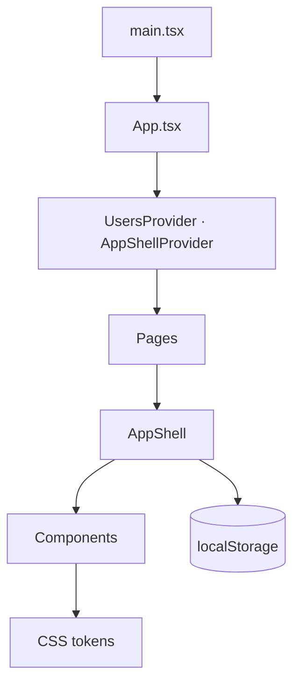
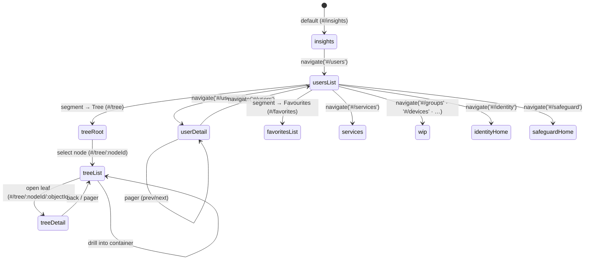

# App Shell w/ Iris UI (React)

A clickable prototype that puts **Active Roles**, **Identity Manager**, **Safeguard**, and **On-Demand Services** behind one shell built on Iris UI foundations, with an inline AI panel, key user flows, and mock data.

## Contents

1. [Quick start](#quick-start)
2. [Architecture](#architecture)
3. [Routing](#routing)
4. [State](#state)
5. [Key flows](#key-flows)
6. [Search, filters & keyboard](#search-filters--keyboard)
7. [Codebase map](#codebase-map)
8. [Architecture notes](#architecture-notes)
9. [Developer notes](#developer-notes)
10. [Product notes](#product-notes)

## Quick start

```bash
# 1. Clone the repository
git clone https://github.com/oi-eng/poc-iris-react.git

# 2. Move into the project directory
cd poc-iris-react

# 3. Install dependencies (uses pnpm)
pnpm install

# 4. Start the dev server at http://localhost:5173
pnpm dev

# 5. Type-check the codebase (tsc --noEmit)
pnpm typecheck

# 6. Create a production build
pnpm build

# 7. Preview the production build locally
pnpm preview
```

The four `package.json` scripts are `dev`, `build`, `preview`, and `typecheck`. There is no test or lint script.

## Architecture

Four layers, each only depends on the layer below:

| Layer | Path | Job |
|---|---|---|
| Tokens | `src/tokens/*.css` (compiled from `*.scss`) | `--oi-*` variables, 11 themes, plus chart + more-theme token sets. |
| Components | `src/components/**` | Stateless UI primitives. Tokens only. |
| Shell | `src/views/AppShell` + `AppHeader`, `GlobalSidebar`, `Sidebar`, `AiPanel` | Chrome around every page. |
| Views | `src/views/{UsersPage,UserDetailPage,InsightsPage,ServicesPage,IdentityManagerPage,SafeguardPage,WipPage,DirectoryPlaceholderPage}` | Page composition + data binding. |

Charts (`BarChart`, `DonutChart`) render with `d3-scale`, `d3-shape`, `d3-selection`, `d3-transition`, `d3-interpolate`, and `d3-ease`. `react` / `react-dom` 19 are the only other runtime dependencies.



Every page wraps its own `<AppShell>`, so the shell remounts on each navigation. Long-lived state (AI panel, attached AI context, secondary-nav choice) lives in [appShellContext.tsx](src/lib/appShellContext.tsx) above the route switch.

---

## Routing

[src/lib/router.ts](src/lib/router.ts) is a hash router with no external deps. Routes are a discriminated union of 16 names: `userDetail`, `usersList`, `treeRoot`, `treeList`, `treeDetail`, `favoritesList`, `groups`, `devices`, `agents`, `applications`, `accessTemplates`, `managementUnits`, `insights`, `services`, `identityHome`, `safeguardHome`. **An empty hash is normalised to the default `#/insights`; any other unrecognised hash falls back to `usersList`** (no 404 surface).

Six directory routes (`groups`, `devices`, `agents`, `applications`, `accessTemplates`, `managementUnits`) render a shared [WipPage](src/views/WipPage/WipPage.tsx) placeholder; `identityHome` and `safeguardHome` render the Identity Manager and Safeguard landing pages. The directory sidebar's **Flat / Tree / Favourites** segment maps to routes: Flat → `#/users`, Tree → `#/tree` (empty → `#/tree/:nodeId` listing → `#/tree/:nodeId/:objectId` detail), Favourites → `#/favorites`.



There is no 404 surface — unknown hashes silently land on `usersList`.

---

## State

No global state library. State is split by lifetime:

| Concern | Where | Survives navigation? | Survives reload? |
|---|---|---|---|
| Search query, row selection, current tab | `useState` in the page | ❌ | ❌ |
| AI panel open, attached AI context, secondary-nav choice | `AppShellContext` | ✅ | ❌ |
| User edits | `UsersContext` (in-memory) | ✅ | ❌ |
| Theme (dark default), sidebar pin, sidebar view | `localStorage` (`ars.theme`) | ✅ | ✅ |
| AI conversations list (per vertical, 50 max) | `localStorage` via [chatHistoryStore.ts](src/lib/chatHistoryStore.ts) | ❌ | ✅ |
| AI chat in progress (current transcript) | `useState` in `AiPanel` | ❌ | ❌ |

The in-progress transcript is saved to the conversations list on every change, so even a mid-conversation navigation away can be resumed by opening the panel and picking the row from **Chat history**. See [A2](#a2--ai-panel-remounts-on-every-navigation).

---

## Key flows

### Switching verticals

Clicking a product in the header calls `navigate('#/…')`; the `hashchange` sets the route, `App` renders the matching page, and `useVertical()` re-derives the chrome. Product chooser, global sidebar, AI panel title, and (optional) secondary sidebar all come from one `Vertical` record in [verticals.ts](src/lib/verticals.ts). Adding a vertical is one record + one route — see [A1](#a1--vertical-model-is-the-extension-point).

### Attaching selection to AI

The only cross-page channel. A page calls `setAiContext([...])` + `setAiOpen(true)`; the panel renders chips and context-aware prompts, then `clearAiContext()` on send.

### Editing a user

`EditPropertiesSheet` holds local form state and calls `UsersContext.updateUser` on save — the single mutation point. It re-derives `name` from `firstName + lastName`, so list and detail stay in sync.

### Resetting a password

Three-state modal: confirm → readonly generated password → "Copied" pill (2s). The password is generated client-side via `crypto.getRandomValues`. See [ResetPasswordModal.tsx](src/views/UserDetailPage/ResetPasswordModal/ResetPasswordModal.tsx).

### Browsing AI chat history

Conversations persist per vertical in `localStorage` ([chatHistoryStore.ts](src/lib/chatHistoryStore.ts)): capped at 50, schema-versioned, sorted newest-first. Storage failures (private mode, quota, parse errors) degrade silently. The history view filters by search and groups rows by date bucket (Today / Yesterday / Previous 7 days / Older) using DST-safe calendar-day boundaries.

---

## Search, filters & keyboard

Three connected capabilities make the shell fully driveable from the keyboard: a global command palette, an advanced filter bar, and app-wide shortcuts with focus management.

### Command palette (⌘K)

A global launcher for search + navigation + actions, mounted once and toggled from anywhere with **⌘K / Ctrl+K** (or the header search button, which shows the `⌘ K` chip). See [CommandPalette.tsx](src/components/CommandPalette/CommandPalette.tsx).

- **Fuzzy search** across pages ("Jump to"), users, and actions, with a scope switch (**All / Users / Pages**).
- **Actions** surface inline: *Toggle AI panel* and *Theme: …* switching.
- An **"Ask AI about ‘<query>’"** entry hands the typed query straight to the AI panel.
- **Recents** — recent searches and recently-viewed pages/users persist via [searchHistoryStore.ts](src/lib/searchHistoryStore.ts) and are individually removable.
- **Fully keyboard-operable** — ↑/↓ move the active row, `Enter` commits, `Esc` closes and restores focus to the previously-focused element; the list drives `aria-activedescendant` while the input keeps focus.

### Advanced filters

The filter bar on the Users page turns loose fields into structured, chip-based filters. See [Filters.tsx](src/components/Filters/Filters.tsx) and [UsersPage.tsx](src/views/UsersPage/UsersPage.tsx).

- Add a filter from the toolbar funnel button (**⌘⇧F / Ctrl+Shift+F**) or the **Add** control inside the bar.
- Fields: **Display Name · Object Type · Tags · Location · Date active · Date created**. Fields without a value UI yet are shown **disabled** in the menu rather than producing an un-configurable chip.
- Each active filter renders as a **chip**: field label + rule pill + value. Values come from a menu (Object Type carries per-type icons) or a native date picker for date fields.
- **Clear** removes every chip at once.
- **Focus lands on the bar** the moment it appears: the bar is a labeled landmark (`role="region"`, `aria-label="Active filters"`) that receives focus on mount, so keyboard and screen-reader users are taken straight to the new filters.

### Keyboard shortcuts & accessibility

| Shortcut | Action | Scope |
|---|---|---|
| `⌘K` / `Ctrl+K` | Open the command palette (search) | Global |
| `⌘/` / `Ctrl+/` | Toggle the Ask AI panel | Global |
| `⌘B` / `Ctrl+B` | Toggle the global sidebar (pin/unpin) | Global |
| `⌘⇧F` / `Ctrl+Shift+F` | Open the Add filter menu | Users page |
| `⌘E` / `Ctrl+E` | Edit user properties | User detail |
| `J` / `K` | Go to next / previous user | User detail |
| `↑` `↓` `Home` `End` | Move between items in an open menu | Any menu |
| `Enter` / `Space` | Activate the focused menu item | Any menu |
| `Esc` | Close the menu / palette / overlay (restores focus) | Contextual |

Supporting focus + a11y behaviour:

- **Menus are keyboard-first.** Opening a menu moves focus to its first *enabled* item; ↑/↓/Home/End rove between items and **skip disabled entries** (matching Tab), `Enter`/`Space` selects, and `Esc` closes and returns focus to the trigger. See [Menu.tsx](src/components/Menu/Menu.tsx).
- **Tooltips no longer fight the click.** The shared [Tooltip](src/components/Tooltip/Tooltip.tsx) dismisses on pointer-down and suppresses the click-induced focus from re-opening it, so tapping a tooltipped button feels instant. Tooltips also render their shortcut as key chips (e.g. `⌘ B`).
- **`J`/`K` are typing-safe.** The next/previous-user keys are ignored while focus is in an `input`, `textarea`, `select`, or `contenteditable`, and when any modifier is held.
- **The sidebar advertises its shortcut** via a tertiary caption in its footer ("Press ⌘B to toggle the sidebar").

---

## Codebase map

```
src/
├── App.tsx                  ← route switch
├── main.tsx                 ← StrictMode root, token + theme bootstrap
├── tokens/                  ← CSS variables (light/dark/HC × primitives/semantic),
│                             compiled from .scss; plus more-themes/ and charts/
├── styles/                  ← reset + typography + base + scroll
├── icons/                   ← Iris icon manifest (~730 KB JSON, 1,511 icons)
├── types/                   ← vite-env.d.ts
├── lib/
│   ├── router.ts            ← hash router + useRoute()
│   ├── verticals.ts         ← Vertical model + useVertical()
│   ├── productMenu.tsx      ← product chooser (vertical-aware)
│   ├── appShellContext.tsx  ← aiOpen / aiContext / activeNav
│   ├── aiContext.ts         ← AiContextItem type
│   ├── chatHistoryStore.ts  ← AI conversations persistence (per-vertical, localStorage)
│   ├── usersStore.tsx       ← in-memory users CRUD
│   ├── useTheme.ts          ← 11-theme switcher (dark default)
│   ├── moreThemes.ts        ← 7 editor-inspired "more themes"
│   ├── chartColors.ts       ← categorical chart series
│   ├── useSidebarPinned.ts  ← localStorage-backed boolean
│   ├── cx.ts                ← className join
│   └── currentUser.ts       ← hard-coded signed-in user
├── components/              ← 38 design-system primitives (incl. Tooltip)
│   └── Sidebar/             ← includes co-located Tree.tsx (static)
└── views/
    ├── AppShell/            ← chrome wrapper
    ├── UsersPage/           ← directory listing + filter menu
    ├── UserDetailPage/      ← detail + EditPropertiesSheet + ResetPasswordModal
    ├── InsightsPage/        ← analytics dashboard (read-only)
    ├── ServicesPage/        ← service catalogue
    ├── IdentityManagerPage/ ← Identity Manager landing page
    ├── SafeguardPage/       ← Safeguard landing page
    ├── WipPage/             ← shared "work in progress" placeholder
    └── DirectoryPlaceholderPage/ ← empty-directory placeholder
```

Repo-level `scripts/` holds standalone WCAG contrast checkers ([a11y-audit.ts](scripts/a11y-audit.ts), [a11y-verify.ts](scripts/a11y-verify.ts), [wcag.ts](scripts/wcag.ts)), run directly with `node scripts/<file>.ts`. `plans/` and `skills/` hold planning docs and transition-design notes; neither ships in the app.

---

## Architecture notes

### A1 — Vertical model is the extension point

The `Vertical` record in [src/lib/verticals.ts](src/lib/verticals.ts) drives:
- Product chooser entry ([productMenu.tsx](src/lib/productMenu.tsx))
- Global sidebar header + nav ([GlobalSidebar.tsx](src/components/GlobalSidebar/GlobalSidebar.tsx))
- AI panel title + greeting ([AiPanel.tsx](src/components/AiPanel/AiPanel.tsx))
- Optional secondary sidebar ([AppShell.tsx](src/views/AppShell/AppShell.tsx))

To add a vertical:
1. Add a `Vertical` record.
2. Add a route to `ROUTES` in `router.ts` and a case to the `Route` union.
3. Add a render branch in `App.tsx`.
4. Add an entry to `PRODUCTS` in `productMenu.tsx`.

No component changes needed.

### A2 — AI panel remounts on every navigation

Each page mounts its own `<AppShell>`, which mounts a fresh `<AiPanel>`. Only `aiOpen` lives in context, so the in-progress transcript is wiped on every route change. The saved conversation list is unaffected — it is persisted per-vertical in `localStorage` via [chatHistoryStore.ts](src/lib/chatHistoryStore.ts) (schema-versioned, capped at 50 entries, oldest dropped on quota errors) — so users can re-open the panel after navigating and pick the prior chat from **Chat history**.

If the remount itself becomes a problem, lift `messages`/`stream`/`isTyping` into `AppShellContext`, or render `<AiPanel>` once in `App.tsx` above the route switch. See also [A4](#a4--shell-remount-cost).

### A3 — No backend boundary

`UsersContext.updateUser` is synchronous, optimistic, and total. No loading state, error state, or conflict handling. First real integration must decide: server vs optimistic, partial-success patches, pagination.

### A4 — Shell remount cost

Every navigation tears down and re-instantiates the header, both sidebars, and the AI panel. Invisible today; will be measurable as the app grows. Fix: render `<AppShell>{routedChild}</AppShell>` once in `App.tsx`.

### A5 — Icons are one 730 KB JSON

[src/icons/manifest.json](src/icons/manifest.json) is ~730 KB raw (1,511 icons). [Icon.tsx](src/components/Icon/Icon.tsx) imports the whole manifest and resolves icons by dynamic name, so the bundler can't tree-shake unused icons — only a small fraction are actually referenced.

> **Note:** Icon tree-shaking is still **pending**. Because all 1,511 icons are bundled, `pnpm build` emits a chunk-size warning — the JS chunk is ~1.13 MB (~230 KB gzipped), over Vite's 500 kB limit. This is expected until the mitigation below lands.

Mitigations:
- Generate a build-time manifest of only the names referenced in `src/**`.
- Switch to `import.meta.glob('./icons/*.svg', { as: 'raw' })`.

### A6 — No 404 surface

Unknown hashes silently land on `usersList`. Fine for the PoC; production needs a `notFound` route + page.

---

## Developer notes

### D1 — Conventions worth keeping

- **CSS Modules + tokens only.** No utility CSS, no inline colours. Themes work without per-component overrides.
- **`.js` import specifiers from `.ts` files.** Vite + the tsconfig (`module: ESNext`, `moduleResolution: Bundler`) accept them.
- **Stateless components, smart pages.** Components never reach into context.
- **Discriminated unions** for routes, AI messages, services, AI attachments.

### D2 — TS strict mode is off

[tsconfig.json](tsconfig.json) sets `strict: false`, `noImplicitAny: false`. The codebase is mostly well-typed in practice; flipping `strict` on would catch implicit `any` in handlers and untyped router lookups. One short fix-up pass should clear it.

### D3 — No tests

First tests worth writing:
- `router.ts → parseHash()` — pure function, drives everything.
- `usersStore → updateUser()` — has derived-field logic.
- `sliceMessage()` in `AiPanel` — streaming edge cases.
- `verticalForRoute()` — easy to break silently.

Suggested: Vitest + React Testing Library.

### D4 — No lint / format

No ESLint, no Prettier, no pre-commit hook. Minimum useful add: ESLint + `eslint-plugin-react-hooks` to catch missing dependency arrays. Files where this matters most: `AiPanel`, `AppShell`, `Modal`, `SideSheet`.

### D5 — Hand-built overlays

`Modal`, `SideSheet`, `Menu`, `Tabs`, `SegmentedControl` are bespoke — no Radix/HeadlessUI. Pros: zero deps, full token control. Cons: a11y edge cases (focus trap, roving tabindex, `aria-activedescendant`) are easy to miss. Worth one axe-core pass before any production launch.

### D6 — Mocks live next to views

[mockUsers.ts](src/views/UsersPage/mockUsers.ts), [mockInsights.ts](src/views/InsightsPage/mockInsights.ts), [mockServices.ts](src/views/ServicesPage/mockServices.ts). Swap one file per page when wiring a real backend.

### D7 — Known data-model leak

`InsightsPage` overlays `RecentUserActivity` onto `User` objects so "recent activity" rows link to valid detail pages. `mockInsights.ts` must keep its ids in sync with `mockUsers.ts`. Document or assert at build time.

### D8 — Hand-rolled tiny utilities

- `cx.ts` instead of `classnames`/`clsx` (~10 lines).
- `router.ts` instead of `react-router` (~110 lines).
- Theme persistence instead of `next-themes`.

Small, contained, easy to swap. Keep them.

### D9 — Standalone contrast checkers

`scripts/a11y-audit.ts` and `scripts/a11y-verify.ts` (backed by `scripts/wcag.ts`) check WCAG 2.2 Level AA contrast for the seven "more themes". They are node scripts (`node scripts/a11y-audit.ts`), not wired to any `package.json` script, and run against hard-coded token values rather than the live CSS.

---

## Product notes

### P1 — What the PoC demonstrates

Active Roles and On-Demand Services share one shell; Identity Manager and Safeguard are landing-page stubs. A single product chooser swaps the vertical, and the chrome adapts copy, nav, and brand.

### P2 — Flows that work end-to-end

| Flow | Status |
|---|---|
| List directory users (search, multi-select, action bar, copy Object ID) | ✅ |
| Command palette (⌘K — search pages/users/actions, recents, scopes) | ✅ |
| Filter menu (Display Name / Object Type / Tags / Location / Date active / Date created) | ✅ |
| View user details (tabs — Overview only; prev/next pager) | ✅ |
| Edit user properties (side sheet, session-persistent) | ✅ |
| Reset password (3-state modal, readonly password + copy) | ✅ |
| Sidebar Flat ⇄ Tree ⇄ Favourites (route-driven; each swaps the whole rail) | ✅ |
| Tree view (interactive tree → node listing → type-driven object detail) | ✅ |
| Favourites (star objects from row/detail menus; curated shortcut list) | ✅ |
| Insights (three tabs, stat cards, two bar charts, donut) | ✅ |
| Services (catalogue + extensions) | ✅ |
| Ask AI about selection (chips → context prompts → streamed reply) | ✅ |
| AI chat history (per vertical, persisted, search + date grouping) | ✅ |
| Switch theme (11 themes, persisted, dark default) | ✅ |
| Switch product/vertical (updates nav, AI title, sidebar) | ✅ |

### P3 — Visible but inactive

These look interactive but currently no-op. Call out during demos.

- Sidebar "Other" nav items (Settings, Help) — disabled placeholders.
- Action bar bulk operations (Copy, Move, Properties, Delete).
- `Add user` split-button. `More actions` opens a menu but `Export CSV` is a no-op.
- UserDetailPage tabs other than Overview (Profile, Certificates, History) — "Coming soon".
- Service card actions (Sliders, Speedometer, "Get in touch", "Learn more", "Start free trial", Refresh, Status report).

### P4 — Accessibility

- Eleven themes: four core (Light, Dark, High contrast light, High contrast dark) plus seven custom "more themes" (Dracula, Night Owl, Ayu, One Dark Pro, Tokyo Night, Catppuccin, Monokai).
- `prefers-reduced-motion` respected by `AiPanel` and `Modal`.
- All interactive elements have `aria-label` or visible text.
- Keyboard operation and focus management are covered in [Search, filters & keyboard](#search-filters--keyboard).
- Icon-only controls use the shared `Tooltip` (hover + keyboard, shortcut chips); native `title=` is not used.
- Overlays are hand-built — needs a formal a11y audit before production.

### P5 — Performance

- Bundle is dominated by the icon manifest ([A5](#a5--icons-are-one-730-kb-json)).
- First paint is fast — no data fetching.
- AI panel uses simulated streaming (`5 chars / 16 ms`) + typing indicator, with a reduced-motion fallback.
- `DonutChart` reflows via a `@container` query, so the legend stacks under the donut when its card narrows (e.g. side sheet open) without depending on viewport breakpoints.

### P6 — What a customer cannot do yet

| Limitation | Impact |
|---|---|
| No backend | Edits vanish on reload. |
| Single hard-coded signed-in user | No auth story. |
| Static Insights data | Numbers don't move. |
| Service card actions are decorative | "Start free trial" does nothing. |
| Services has no sub-navigation | Single page only. |
