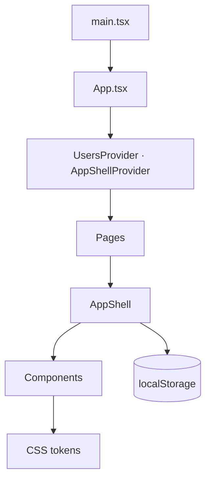

# Architecture

Four layers, each only depends on the layer below:

| Layer | Path | Job |
|---|---|---|
| Tokens | `src/tokens/*.css` (compiled from `*.scss`) | `--oi-*` variables, 11 themes, plus chart + more-theme token sets. |
| Components | `src/components/**` | Stateless UI primitives. Tokens only. |
| Shell | `src/views/AppShell` + `AppHeader`, `GlobalSidebar`, `Sidebar`, `AiPanel` | Chrome around every page. |
| Views | `src/views/{UsersPage,UserDetailPage,InsightsPage,ServicesPage,IdentityManagerPage,SafeguardPage,WipPage,DirectoryPlaceholderPage}` | Page composition + data binding. |

Charts (`BarChart`, `DonutChart`) render with `d3-scale`, `d3-shape`, `d3-selection`, `d3-transition`, `d3-interpolate`, and `d3-ease`. `react` / `react-dom` 19 are the only other runtime dependencies.



Every page wraps its own `<AppShell>`, so the shell remounts on each navigation. Long-lived state (AI panel, attached AI context, secondary-nav choice) lives in [appShellContext.tsx](../src/lib/appShellContext.tsx) above the route switch.

---

## Codebase map

```
src/
├── App.tsx                  ← route switch
├── main.tsx                 ← StrictMode root, token + theme bootstrap
├── tokens/                  ← CSS variables (light/dark/HC × primitives/semantic),
│                             compiled from .scss; plus more-themes/ and charts/
├── styles/                  ← reset + typography + base + scroll
├── icons/                   ← Iris icon manifest (~730 KB JSON, 1,511 icons)
├── types/                   ← vite-env.d.ts
├── lib/
│   ├── router.ts            ← hash router + useRoute()
│   ├── verticals.ts         ← Vertical model + useVertical()
│   ├── productMenu.tsx      ← product chooser (vertical-aware)
│   ├── appShellContext.tsx  ← aiOpen / aiContext / activeNav
│   ├── aiContext.ts         ← AiContextItem type
│   ├── chatHistoryStore.ts  ← AI conversations persistence (per-vertical, localStorage)
│   ├── usersStore.tsx       ← in-memory users CRUD
│   ├── useTheme.ts          ← 11-theme switcher (dark default)
│   ├── moreThemes.ts        ← 7 editor-inspired "more themes"
│   ├── chartColors.ts       ← categorical chart series
│   ├── useSidebarPinned.ts  ← localStorage-backed boolean
│   ├── cx.ts                ← className join
│   └── currentUser.ts       ← hard-coded signed-in user
├── components/              ← 38 design-system primitives (incl. Tooltip)
│   └── Sidebar/             ← includes co-located Tree.tsx (static)
└── views/
    ├── AppShell/            ← chrome wrapper
    ├── UsersPage/           ← directory listing + filter menu
    ├── UserDetailPage/      ← detail + EditPropertiesSheet + ResetPasswordModal
    ├── InsightsPage/        ← analytics dashboard (read-only)
    ├── ServicesPage/        ← service catalogue
    ├── IdentityManagerPage/ ← Identity Manager landing page
    ├── SafeguardPage/       ← Safeguard landing page
    ├── WipPage/             ← shared "work in progress" placeholder
    └── DirectoryPlaceholderPage/ ← empty-directory placeholder
```

Repo-level `scripts/` holds standalone WCAG contrast checkers ([a11y-audit.ts](../scripts/a11y-audit.ts), [a11y-verify.ts](../scripts/a11y-verify.ts), [wcag.ts](../scripts/wcag.ts)), run directly with `node scripts/<file>.ts`. `plans/` and `skills/` hold planning docs and transition-design notes; neither ships in the app.

---

## Architecture notes

### A1 — Vertical model is the extension point

The `Vertical` record in [src/lib/verticals.ts](../src/lib/verticals.ts) drives:
- Product chooser entry ([productMenu.tsx](../src/lib/productMenu.tsx))
- Global sidebar header + nav ([GlobalSidebar.tsx](../src/components/GlobalSidebar/GlobalSidebar.tsx))
- AI panel title + greeting ([AiPanel.tsx](../src/components/AiPanel/AiPanel.tsx))
- Optional secondary sidebar ([AppShell.tsx](../src/views/AppShell/AppShell.tsx))

To add a vertical:
1. Add a `Vertical` record.
2. Add a route to `ROUTES` in `router.ts` and a case to the `Route` union.
3. Add a render branch in `App.tsx`.
4. Add an entry to `PRODUCTS` in `productMenu.tsx`.

No component changes needed.

### A2 — AI panel remounts on every navigation

Each page mounts its own `<AppShell>`, which mounts a fresh `<AiPanel>`. Only `aiOpen` lives in context, so the in-progress transcript is wiped on every route change. The saved conversation list is unaffected — it is persisted per-vertical in `localStorage` via [chatHistoryStore.ts](../src/lib/chatHistoryStore.ts) (schema-versioned, capped at 50 entries, oldest dropped on quota errors) — so users can re-open the panel after navigating and pick the prior chat from **Chat history**.

If the remount itself becomes a problem, lift `messages`/`stream`/`isTyping` into `AppShellContext`, or render `<AiPanel>` once in `App.tsx` above the route switch. See also [A4](#a4--shell-remount-cost).

### A3 — No backend boundary

`UsersContext.updateUser` is synchronous, optimistic, and total. No loading state, error state, or conflict handling. First real integration must decide: server vs optimistic, partial-success patches, pagination.

### A4 — Shell remount cost

Every navigation tears down and re-instantiates the header, both sidebars, and the AI panel. Invisible today; will be measurable as the app grows. Fix: render `<AppShell>{routedChild}</AppShell>` once in `App.tsx`.

### A5 — Icons are one 730 KB JSON

[src/icons/manifest.json](../src/icons/manifest.json) is ~730 KB raw (1,511 icons). [Icon.tsx](../src/components/Icon/Icon.tsx) imports the whole manifest and resolves icons by dynamic name, so the bundler can't tree-shake unused icons — only a small fraction are actually referenced.

> **Note:** Icon tree-shaking is still **pending**. Because all 1,511 icons are bundled, `pnpm build` emits a chunk-size warning — the JS chunk is ~1.13 MB (~230 KB gzipped), over Vite's 500 kB limit. This is expected until the mitigation below lands.

Mitigations:
- Generate a build-time manifest of only the names referenced in `src/**`.
- Switch to `import.meta.glob('./icons/*.svg', { as: 'raw' })`.

### A6 — No 404 surface

Unknown hashes silently land on `usersList`. Fine for the PoC; production needs a `notFound` route + page.
