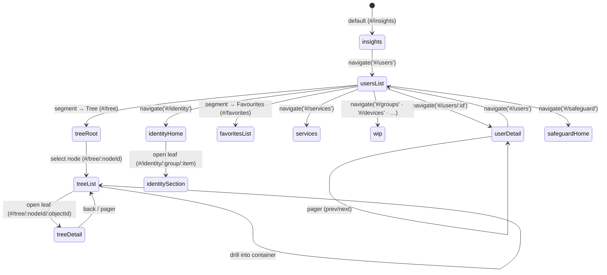

# Routing

[src/lib/router.ts](../src/lib/router.ts) is a hash router with no external deps. Routes are a discriminated union of 20 names: `userDetail`, `usersList`, `treeRoot`, `treeList`, `treeDetail`, `favoritesList`, `groups`, `devices`, `agents`, `applications`, `accessTemplates`, `managementUnits`, `insights`, `services`, `identityHome`, `identityInsights`, `identitySettings`, `identityHelp`, `identitySection`, `safeguardHome`. **An empty hash is normalised to the default `#/insights`; any other unrecognised hash falls back to `usersList`** (no 404 surface).

Six directory routes (`groups`, `devices`, `agents`, `applications`, `accessTemplates`, `managementUnits`) render a shared [WipPage](../src/views/WipPage/WipPage.tsx) placeholder. The directory sidebar's **Flat / Tree / Favourites** segment maps to routes: Flat → `#/users`, Tree → `#/tree` (empty → `#/tree/:nodeId` listing → `#/tree/:nodeId/:objectId` detail), Favourites → `#/favorites`.

The **Identity Manager** vertical uses a small fixed set plus one parameterised route so it scales to any number of nav items: `identityHome` → `#/identity`, `identityInsights` → `#/identity/insights`, `identitySettings` → `#/identity/settings`, `identityHelp` → `#/identity/help`, and `identitySection` → `#/identity/:group/:item` for every grouped leaf. `safeguardHome` renders the Safeguard landing page.

There is no 404 surface — unknown hashes silently land on `usersList`.
